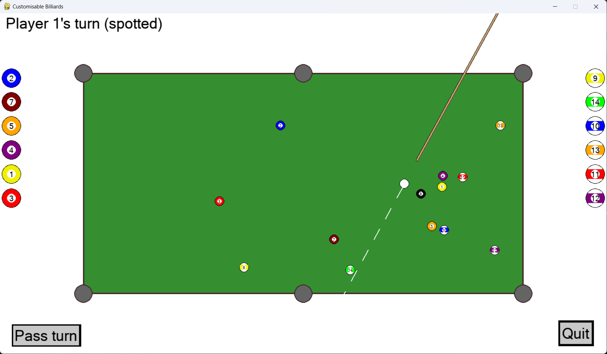

# customisable-billiards
*(project not currently being maintained)*.

A 2D 8-ball pool simulation game with fully-customisable simulated physics, allowing online and offline play, custom shot mode, replays, competitive matches, statististics, leaderboards, and more.
Created in Python 3 using the Pygame library with a custom UI system, using discrete collision resolution methods. 



## Features
- Offline and online multiplayer
- Realistic physics (gravity, accelaration, inelastic collisions, friction and drag, etc.)
- 13 customisable physics settings (gravitational field strength, table & ball coefficients of restitution, ball coefficient of drag, air density, ball mass, static & rolling friction, cue impact time, table length and width, and ball & pocket radius).
- Presets (save and load your favourite physics settings).
- Standard 8-ball pool game rules.
- Online user account system.
- Online competitive games with a competitive ranking system.
- Online casual games with customisable physics using a lobby system with public/private lobbies and a lobby browser.
- User account statistics.
- Server leaderboards.
- Practice mode with a table editor to set up custom shots.
- Replay system allowing you to save and review replays of both online and offline games.
- Custom UI built on top of pygame.

## Depedencies
- pygame 2.2.0

# Installation
After installing the required dependencies, run 
```bash
python client.py
```
to create a client instance. Run 
```bash
python server.py
``` 
to create a local server instance. Server IP and competitive information can be modified in `server_info/conn_info.txt` as required.
